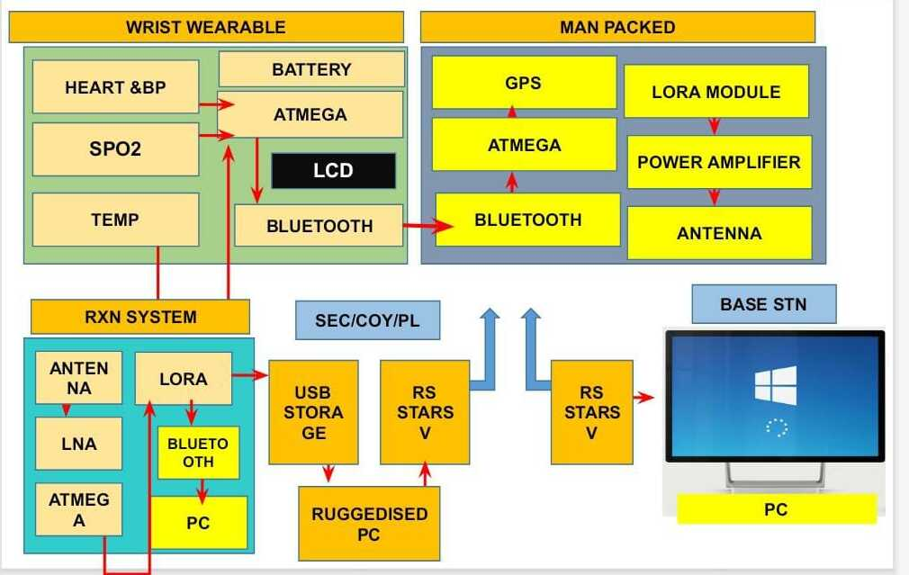
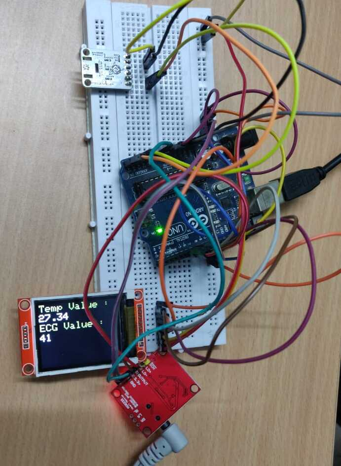

# Wearable-Health-Monitoring-System

## Description
In this work, classical, optimal, and force-based controllers are designed for a 3 DOF spherical manipulator in Matlab-Simulink. The controllers are deployed and verified on the KUKA IIWA LBR7 industrial manipulator in ROS-Gazebo simulator using the ros_controls package.
Some intreseting results are seen in the comparison of these controllers for the robotic manipulator.

Controllers:
- Proportional Integral Derivative (PID)
- Linear Quadratic Regulator (LQR)
- Impedence Control

